# Photovoltaic Simulation & DPSO MPPT Backend

A Python-based backend simulation for Photovoltaic (PV) modules operating under varying and dynamic partial shading conditions. This project predicts single diode parameters for cells using **Artificial Neural Nets (ANN)**, before using this information to calculate complex P-V curves using the model. It either uses the **Calculate IV Implicit Model** with a **Deterministic Particle Swarm Optimization (DPSO)** algorithm or **Refactored IV Explicit Model** to accurately track the Global Maximum Power Point (MPP).

Additionally, it includes a UDP server component designed to harvest real-time irradiance data from a Unity 3D frontend simulation.
### Frontend Reqs:
* **data_harvester.py** Harvest data from the Unity simulation.
* **data_to_pmp.py** Uses explicit model or a tracker to convert irradiance data to a power over time data.
* **results_gathering.py** Takes a snapshot of the panel shading from Unity and converts to a results dashboard.
* **graphing.py** Converts the power over time data to a curve.


## Features
* **Cell Single Diode Modelling:** Uses a heuristic method to model cell parameters, 
* **Dynamic Partial Shading:** Simulates complex shading patterns across individual cells and bypass diode substrings.
* **DPSO MPPT Tracking:** A custom hybrid tracking algorithm that uses Particle Swarm Optimization to find the global maximum and Local P&O for fine-tuning.
* **Unity Integration:** A built-in UDP server (`results_gathering.py`) to receive real-time raytraced irradiance arrays from Unity.
* **Automated Graphing:** Generates convergence plots and power-over-time dashboards.

## Prerequisites & Running

Ensure you have Python 3.9+ installed. Install the required dependencies using pip:

```bash
pip install -r requirements.txt
```

The Unity zip folder 3Dmodel is available upon request from sc23s2e@leeds.ac.uk
Unzip the 3Dmodel folder to run the model using unity 

To gather a snapshot:
```bash
python frontend_reqs/results_gathering.py
```

To gather a day of data:
```bash
python frontend_reqs/data_harvester.py
```

Press play on the unity model to run the simulator and gather the shade data 

If gathered a day of data can run:
```bash
python frontend_reqs/data_to_pmp.py
python frontend_reqs/graphing.py
```
To generate the day snapshot data


## Demo
Run the demo.ipynb file for more information on the process 
Shows the steps:
1. Module parameter prediction
2. Cell parameter prediction and ANN
3. Whole module P-V modelling
4. DPSO tracking methods
5. Power over time curve generation

## Results
Graphical model day/night cycle:


| Graphical Image | Results |
| :--- | :--- |
| 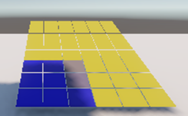 | 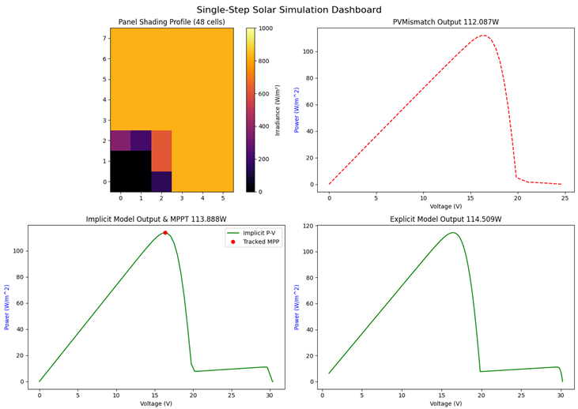 |
| 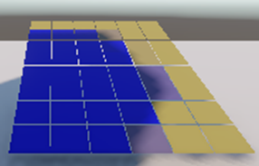 | 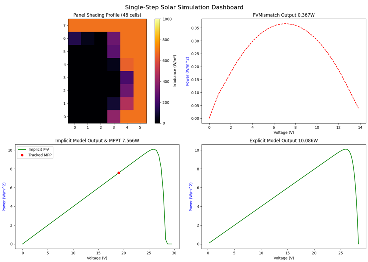 |
| 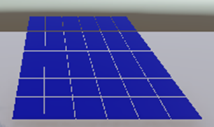 | 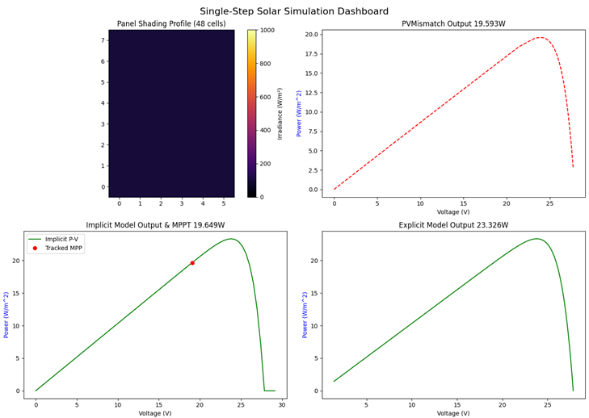 |
| 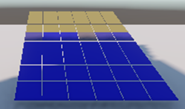 | 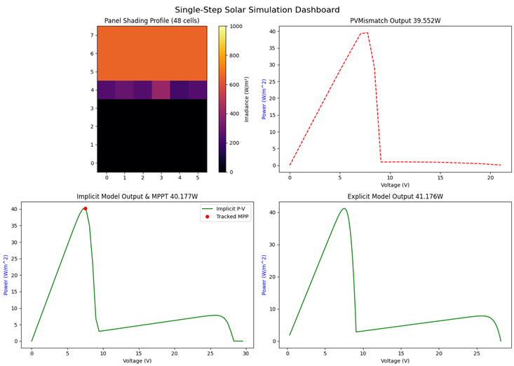 |
| 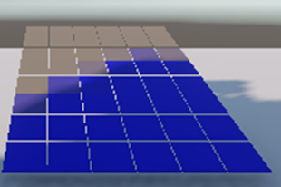 | 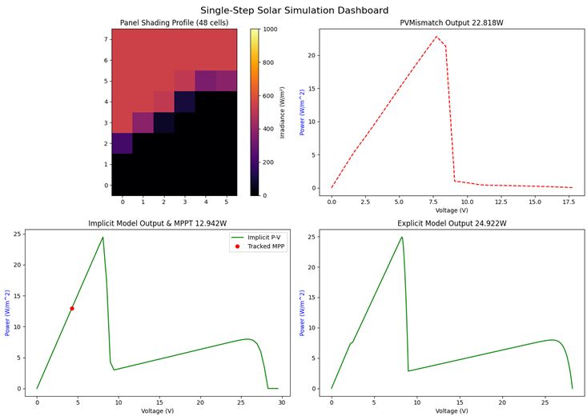 |
| 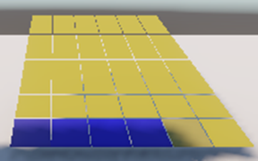 |  |
